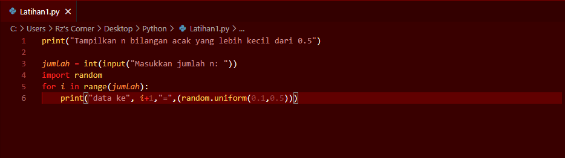
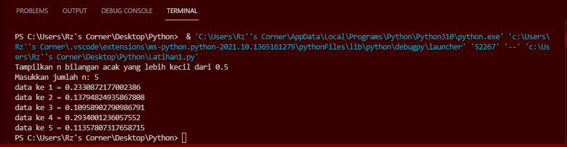
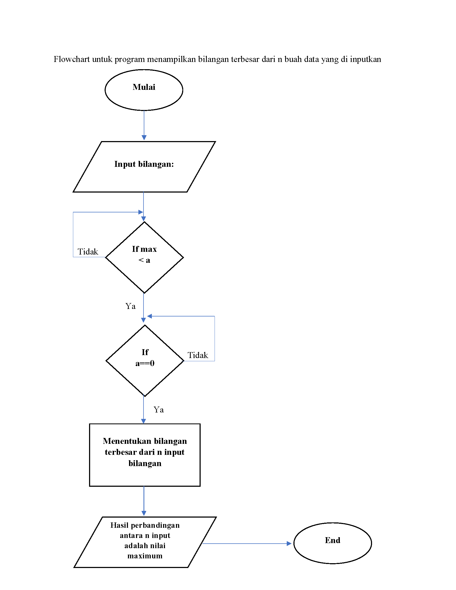
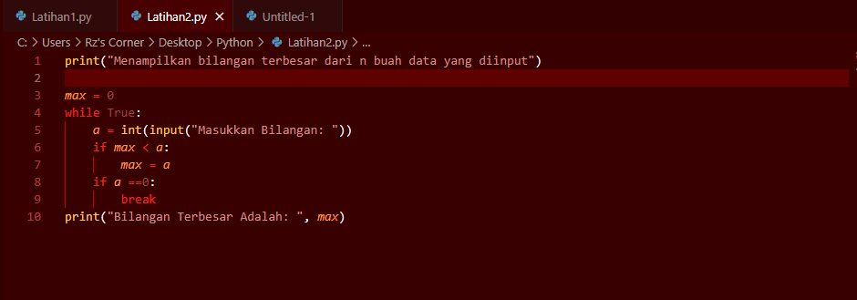
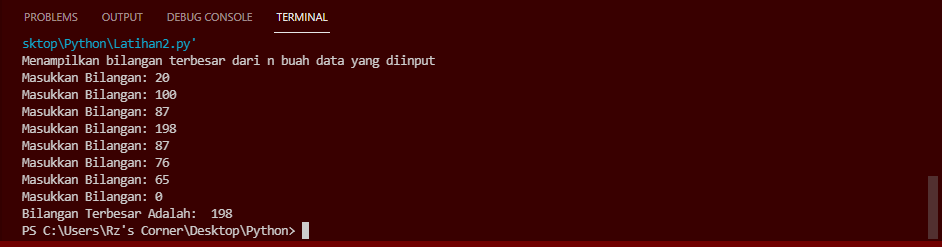

# Labspy03
# Latihan 1 

## Program Untuk Menampilkan n Bilangan Acak Yang Lebih Kecil Dari 0.5

### Flowchart Program
#### berikut flowchart dari program latihan 1, untuk menampilkan n bilangan acak yang lebih kecil dari 0.5

### Penjelasan alur program
1. print("Tampilkan n bilangan acak yang lebih kecil dari 0.5") - adalah perintah untuk menampilkan judulnya.

2. jumlah = int(input("Masukkan jumlah n: ")) - adalah perintah untuk menginput nilai n tersebut

3. import random - adalah perintah untuk mengimport built-in random yang telah tersedia di python

4. for i in range(jumlah): - adalah perintah untuk i sebagai integer dalam baris jumlah

5.    print("data ke", i+1,"=",(random.uniform(0.1,0.5))) - adalah perintah untuk menampilkan hasil yang telah di input dengan ketentuan random uniform mulai dari nilai 0.1 sampai 0.5

#### berikut gambaran programnya

#### berikut hasil dari program saat dijalankan

# Latihan 2

## Buat program untuk menampilkan bilangan terbesar dari n buah data yang diinputkan

### Flowchart program
#### Berikut flowchar untuk program menampilkan bilangan tersbesar dari n buah data yang diinputkan

### penjelasan alur program
1. print("Menampilkan bilangan terbesar dari n buah data yang diinput") - adalah perintah untuk menampilkan judul program

2. max = 0 - adalah perintah untuk menampilkan nilai max yang adalah 0
3. while True: - adalah perintah untuk pengulangan hingga waktu yang tidak ditentukan
4.    a = int(input("Masukkan Bilangan: ")) - adalah perintah untuk menginput nilai integer
5.    if max < a: - adalah perintah untuk tipe data if atau jika, maksimal nilai lebih kecil dari a atau integer
6.        max = a - perintah untuk nilai maximal sama dengan a atau integer
7.    if a ==0: - perintah untuk tipe data if atau jika a sama dengan 0 maka
8.        break - perintah untuk mengakhiri pengulangan, jadi jika menginput nilai 0 maka pengulangan berakhir atau selesai
9. print("Bilangan Terbesar Adalah: ", max) - adalah perintah untuk menampilkan hasil bilangan yang terbesar dari angka-angka yang telah terinput

#### berikut gambaran programnya

#### berikut hasil program saat dijalankan

