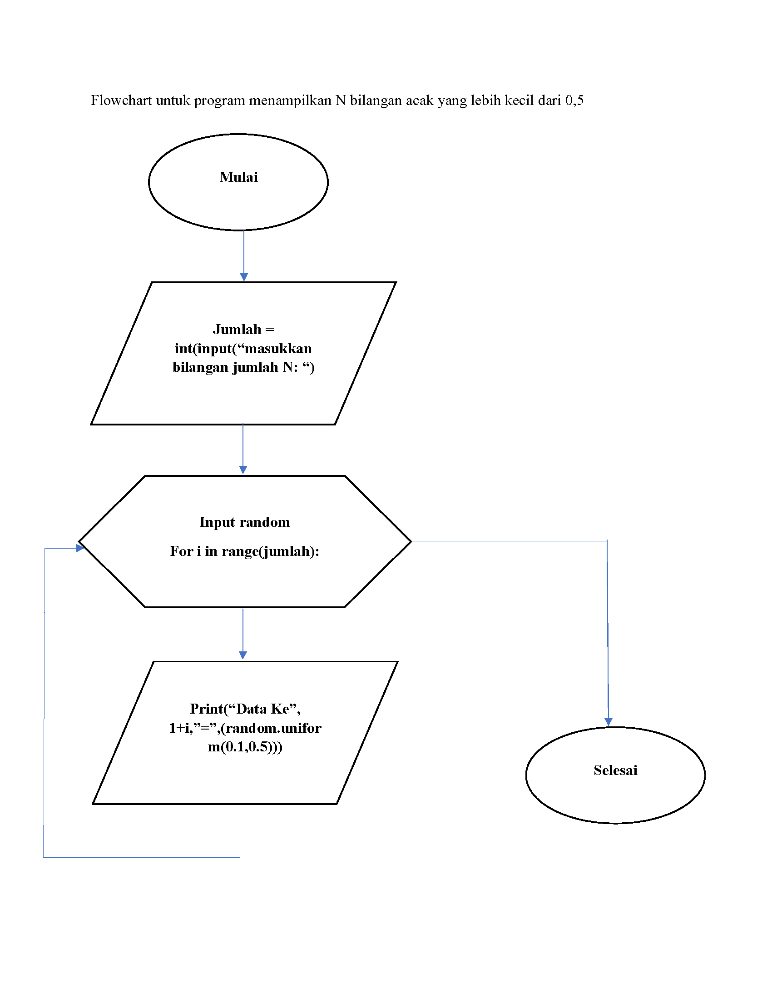

# Labspy03
# Latihan 1 

## Program Untuk Menampilkan n Bilangan Acak Yang Lebih Kecil Dari 0.5

### Flowchart Program
#### berikut flowchart dari program latihan 1, untuk menampilkan n bilangan acak yang lebih kecil dari 0.5

### Penjelasan alur program
1. print("Tampilkan n bilangan acak yang lebih kecil dari 0.5") - adalah perintah untuk menampilkan judulnya.

2. jumlah = int(input("Masukkan jumlah n: ")) - adalah perintah untuk menginput nilai n tersebut

3. import random - adalah perintah untuk mengimport built-in random yang telah tersedia di python

4. for i in range(jumlah): - adalah perintah untuk i sebagai integer dalam baris jumlah

5.    print("data ke", i+1,"=",(random.uniform(0.1,0.5))) - adalah perintah untuk menampilkan hasil yang telah di input dengan ketentuan random uniform mulai dari nilai 0.1 sampai 0.5

#### berikut gambaran programnya

